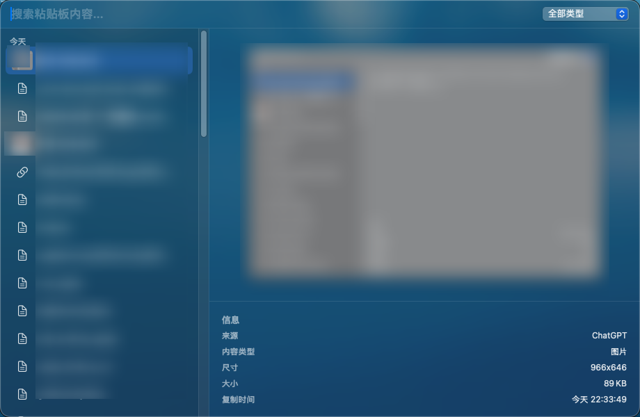
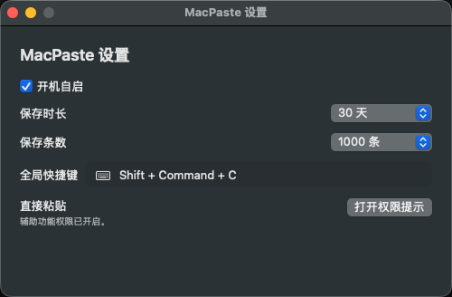

# MacPaste

MacPaste 是一个轻量级 macOS 剪贴板历史工具。它的定位是把 Raycast 里的 Clipboard History 能力单独抽离出来，做成一个体积小、功能聚焦、只处理剪贴板历史的独立工具。

它常驻菜单栏，本地记录最近复制过的文本和图片，支持搜索、预览、复制和直接粘贴回当前应用。

## 截图





## 功能特性

- 菜单栏剪贴板历史面板
- 支持文本、链接、颜色值和图片记录
- 支持搜索和类型筛选
- 支持键盘上下选择、Enter 粘贴
- 支持自定义全局快捷键，默认 `Command + Shift + C`
- 支持按保存天数和保存条数清理历史
- 支持开机自启
- 支持开启辅助功能权限后直接粘贴

## 系统要求

- macOS 13.0 或更高版本
- Xcode Command Line Tools
- Swift Package Manager

## 构建

```bash
swift build -c release
```

构建产物位于 `.build/release/MacPaste`。

## 打包 App

使用打包脚本生成 `MacPaste.app`：

```bash
Scripts/package_app.sh release
```

生成的 App 位于 `.build/MacPaste.app`。

如果需要配置本机默认打包参数，可以复制示例配置：

```bash
cp Scripts/package_app.conf.example Scripts/package_app.conf
```

`Scripts/package_app.conf` 已加入 `.gitignore`，因为它通常包含本机签名证书名称、安装路径等机器相关配置。

支持的配置项：

```bash
CONFIGURATION="release"
INSTALL_APP=0
INSTALL_DIR="/Applications"
CODESIGN_IDENTITY=""
```

本地安装：

```bash
Scripts/package_app.sh release --install
```

也可以通过环境变量指定签名证书：

```bash
CODESIGN_IDENTITY="Developer ID Application: Your Name" Scripts/package_app.sh release
```

如果 `CODESIGN_IDENTITY` 为空，脚本会生成未签名 App。未签名或本地签名的构建，在重新打包后可能需要重新授予辅助功能和开机自启权限。

## 权限说明

MacPaste 记录剪贴板历史、把选中历史写回系统剪贴板，不需要辅助功能权限。

如果要直接粘贴到之前激活的应用，需要开启 macOS 辅助功能权限。可以在 `MacPaste 设置` 中点击 `打开权限提示`，也可以手动打开：

`系统设置 -> 隐私与安全性 -> 辅助功能`

## 数据存储

剪贴板数据只保存在本机：

`~/Library/Application Support/MacPaste/`

SQLite 数据库文件为 `history.sqlite3`，图片文件保存在 `Images/` 目录。

MacPaste 不上传剪贴板数据。剪贴板历史可能包含敏感信息，建议根据自己的使用习惯调整保存时长和保存条数。

## 开源发布前检查

- 当前项目使用 `MIT License`。
- 不要提交 `.build/`、`.DS_Store`、`Scripts/package_app.conf`。
- 如果要发布二进制 App，把 `Resources/Info.plist` 里的 `com.local.MacPaste` 换成你自己的 Bundle Identifier。
- 如果要面向公众分发二进制 App，建议使用 Developer ID 证书签名并进行 notarization。

## License

MIT License. See [LICENSE](LICENSE).

## 项目结构

```text
Sources/MacPaste/       App source code
Resources/              Info.plist and app/menu bar icons
Scripts/package_app.sh  App bundle packaging script
```

## English

MacPaste is a lightweight macOS clipboard history app built with SwiftUI. It is inspired by Raycast Clipboard History, but extracted as a small standalone tool focused only on clipboard history.

It runs from the menu bar, captures recent text and image clipboard entries locally, and lets you search, preview, copy, or paste them back into the active app.

### Screenshots


### Features

- Menu bar clipboard history panel
- Text, link, color, and image capture
- Search and type filtering
- Keyboard navigation and Enter-to-paste
- Configurable global shortcut, default `Command + Shift + C`
- Retention limits by days and item count
- Optional launch at login
- Optional Accessibility permission for direct paste

### Build

```bash
swift build -c release
```

### Package

```bash
Scripts/package_app.sh release
```

The app bundle is generated at `.build/MacPaste.app`.

For local packaging defaults:

```bash
cp Scripts/package_app.conf.example Scripts/package_app.conf
```

`Scripts/package_app.conf` is intentionally ignored by Git because it may contain machine-specific signing identity and install path settings.

### Data Storage

Clipboard data is stored locally under:

`~/Library/Application Support/MacPaste/`

MacPaste does not upload clipboard data.
